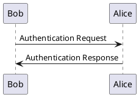

# GitHub API
[link with endpoints](https://api.github.com/)  
[search api blog](https://stateful.com/blog/github-search-api)

## Request to find files with extension .uml
```sh
gh api search/code?q=extension:uml
```

## Request to find .uml files with sequence diagram by keyword participant
```sh
gh api search/code?q=participant+extension:uml
```  
Other keywords in plantuml sequence diagrams:
- participant
- actor
- boundary
- control
- entity
- database
- collections
- queue

But this is also sequence diagram. Difference from class diagram is missing class typing on beggining eg. _class Bob_


## URLs to .uml sequence diagrams
```sh
gh api search/code?q=participant+extension:uml --jq ".items[].html_url" --paginate
```
Prints by pages, problem with limit.  
[Current result](github_uml_seq.txt)
!!! Mostly staruml xml

## URLs to plantuml sequence diagrams
```sh
gh api search/code?q=participant+@startuml+extension:uml --jq ".items[].html_url" --paginate
```
[Current result](github_plantuml_seq.txt)