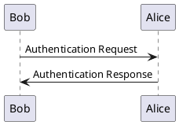

# GitHub API
[link with endpoints](https://api.github.com/)  
[search api blog](https://stateful.com/blog/github-search-api)

## Request to find files with extension .uml
```sh
gh api search/code?q=extension:uml
```

## Request to find .uml files with sequence diagram by keyword participant
```sh
gh api search/code?q=participant+extension:uml
```  
Other keywords in plantuml sequence diagrams:
- participant

-------
conditions
- alt, opt, loop, par, group
-------
activations
- activate, deactivate
-------
lifespan terminations
- destroy

(can be used also for categorization sequence diagrams by flags + sync/async)

But this is also sequence diagram. Difference from class diagram is missing class typing on beggining eg. _class Bob_


- not containing "class" keyword

### Keyword in xml/xmi files for sequence diagram
Element has argument `<packagedElement xmi:type="uml:Interaction"`

## URLs for .uml sequence diagrams
```sh
gh api search/code?q=participant+extension:uml --jq ".items[].html_url" --paginate
```
Prints by pages, problem with limit.  
[Current result](github_uml_seq.txt)
!!! Mostly staruml xml

## URLs to plantuml sequence diagrams
```sh
gh api search/code?q=participant+@startuml+extension:uml --jq ".items[].html_url" --paginate
```
[Current result](github_plantuml_seq.txt)

## URLs for .uml files from repo swmuir/fhims
```sh
gh api search/code?q=repo:swmuir/fhims+extension:uml --jq ".items[].html_url"
```

# Raw file url
Replace https://github.com with https://raw.githubusercontent.com and delete /blob from url