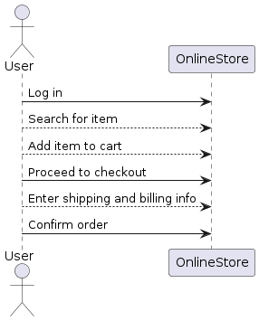

## Request
```json
{
        "promt": [
            {"role": "user", "content": """Here is XML scheme for future tasks
<!ELEMENT useCase (description?, mainSequence, alternativeSteps?, errorSteps?)>
<!ATTLIST useCase id CDATA   #REQUIRED>

<!ELEMENT mainSequence (step+)>
<!ELEMENT alternativeSteps (astep+)>
<!ELEMENT errorSteps (estep+)>
<!ELEMENT step (#PCDATA)>
<!ATTLIST step id CDATA   #REQUIRED>
<!ELEMENT astep (#PCDATA)>
<!ATTLIST astep id CDATA   #REQUIRED>
<!ELEMENT estep (#PCDATA)>
<!ATTLIST estep id CDATA   #REQUIRED>"""},
            {"role": "user", "content": "Generate longer usecase XML and plantuml source code for corresponding sequence diagram without any your comments"},
        ],
        "response": "```xml\n<useCase id="1">\n    <description>\n        This use case describes the process of purchasing an item from an online store.\n    </description>\n    <mainSequence>\n        <step id="1">User logs into the online store.</step>\n        <step id="2">User searches for the item they want to purchase.</step>\n        <step id="3">User adds the item to their shopping cart.</step>\n        <step id="4">User proceeds to checkout.</step>\n        <step id="5">User enters shipping and billing information.</step>\n        <step id="6">User confirms the order.</step>\n    </mainSequence>\n    <alternativeSteps>\n        <astep id="1">If user is not logged in, prompt them to log in or create an account.</astep>\n        <astep id="2">If the item is out of stock, notify the user and suggest similar items.</astep>\n    </alternativeSteps>\n    <errorSteps>\n        <estep id="1">If an error occurs during checkout, display an error message and ask the user to try again.</estep>\n    </errorSteps>\n</useCase>\n```\n\n```plantuml\n@startuml\nactor User\nUser -> OnlineStore: Log in\nUser --> OnlineStore: Search for item\nUser --> OnlineStore: Add item to cart\nUser -> OnlineStore: Proceed to checkout\nUser --> OnlineStore: Enter shipping and billing info\nUser -> OnlineStore: Confirm order\n@enduml\n```"
    }
```
## Formated response
```xml
<useCase id="1">
    <description>
        This use case describes the process of purchasing an item from an online store.
    </description>
    <mainSequence>
        <step id="1">User logs into the online store.</step>
        <step id="2">User searches for the item they want to purchase.</step>
        <step id="3">User adds the item to their shopping cart.</step>
        <step id="4">User proceeds to checkout.</step>
        <step id="5">User enters shipping and billing information.</step>
        <step id="6">User confirms the order.</step>
    </mainSequence>
    <alternativeSteps>
        <astep id="1">If user is not logged in, prompt them to log in or create an account.</astep>
        <astep id="2">If the item is out of stock, notify the user and suggest similar items.</astep>
    </alternativeSteps>
    <errorSteps>
        <estep id="1">If an error occurs during checkout, display an error message and ask the user to try again.</estep>
    </errorSteps>
</useCase>
```

```plantuml
@startuml
actor User
User -> OnlineStore: Log in
User --> OnlineStore: Search for item
User --> OnlineStore: Add item to cart
User -> OnlineStore: Proceed to checkout
User --> OnlineStore: Enter shipping and billing info
User -> OnlineStore: Confirm order
@enduml
```

